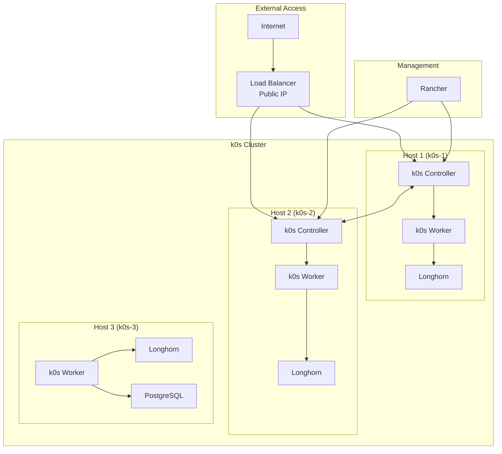

# k0s High-Availability Cluster Deployment Guide

## Table of Contents

1. [Overview](#overview)
2. [Prerequisites](#prerequisites)
3. [Cluster Architecture](#cluster-architecture)
4. [Ansible Setup](#ansible-setup)
5. [k0s Installation](#k0s-installation)
6. [Cluster Initialization](#cluster-initialization)
7. [Longhorn Storage Deployment](#longhorn-storage-deployment)
8. [Rancher Installation](#rancher-installation)
9. [Load Balancer Configuration](#load-balancer-configuration)
10. [PostgreSQL Deployment](#postgresql-deployment)
11. [KubeVirt Integration (Optional)](#kubevirt-integration-optional)
12. [Cluster Updates and Maintenance](#cluster-updates-and-maintenance)
13. [Troubleshooting](#troubleshooting)
14. [Security Considerations](#security-considerations)

## Overview

This guide provides step-by-step instructions for deploying a highly available k0s Kubernetes cluster with the following specifications:

- **3 Ubuntu hosts** with mixed controller/worker roles
- **2 k0s controllers** for high availability
- **3 worker nodes** for workload distribution
- **Tolerance for one host failure** through proper distribution
- **Longhorn storage** with distributed replication
- **Rancher** for cluster administration
- **Ansible** for host management and automation
- **Load balancer** with public IP access
- **PostgreSQL** with high availability using CloudNativePG
- **Optional KubeVirt** integration for virtual machine workloads

The deployment is designed for experienced DevOps engineers familiar with Kubernetes concepts and Ansible automation.

## Prerequisites

### System Requirements

- **3 Ubuntu 22.04 LTS hosts** with minimum specifications:
  - CPU: 4 cores
  - Memory: 8GB RAM
  - System Storage: 50GB SSD (for OS and k0s)
  - **Dedicated Storage Drive**: 200GB+ SSD (for Longhorn storage)
  - **Dual Network Interfaces**:
    - `eth0`: Public network interface (for external traffic)
    - `eth1`: Private network interface (for Kubernetes internal traffic)
  - Network: Gigabit Ethernet
- **Public IP address** for load balancer
- **SSH access** with sudo privileges on all hosts
- **Ansible control node** (can be one of the hosts or separate machine)

### Software Requirements

- Ansible 2.12+ on control node
- k0s v1.27+ (latest stable version)
- Docker/containerd runtime
- Required ports opened (see [Network Requirements](#network-requirements))

### Network Requirements

#### Network Interface Configuration

Each host should be configured with two network interfaces:

- **eth0 (Public Interface)**: For external access and load balancer traffic
- **eth1 (Private Interface)**: For Kubernetes internal cluster communication

#### Port Requirements

Ensure the following ports are open between cluster nodes on the private network (eth1):

| Port | Protocol | Description | Interface |
|------|----------|-------------|-----------|
| 6443 | TCP | Kubernetes API Server | eth1 |
| 8472 | UDP | VXLAN overlay networking | eth1 |
| 10250 | TCP | Kubelet API | eth1 |
| 9100 | TCP | cAdvisor metrics | eth1 |
| 8080 | TCP | Longhorn UI (optional) | eth0 |
| 443 | TCP | Rancher UI | eth0 |

#### Public Network Ports

Open these ports on the public interface (eth0):

| Port | Protocol | Description |
|------|----------|-------------|
| 443 | TCP | HTTPS (Rancher, applications) |
| 80 | TCP | HTTP (redirect to HTTPS) |
| 5432 | TCP | PostgreSQL (if external access needed) |

## Cluster Architecture

### Node Distribution

The cluster will be distributed across 3 hosts with the following role assignment:

| Host | Roles | Components |
|------|-------|------------|
| k0s-1 | Controller + Worker | k0s controller, etcd, kubelet, Longhorn |
| k0s-2 | Controller + Worker | k0s controller, etcd, kubelet, Longhorn |
| k0s-3 | Worker | kubelet, Longhorn, PostgreSQL |

### High Availability Design

- **Controller HA**: 2 controllers with etcd quorum
- **Storage HA**: Longhorn with 2-way replication
- **Database HA**: PostgreSQL with streaming replication
- **Failure Tolerance**: Cluster can survive loss of any single host

### Architecture Diagram



## Ansible Setup

### Directory Structure

Create the following directory structure for your Ansible deployment:

```
k0s-ansible/
├── inventory/
│   └── hosts.ini
├── group_vars/
│   ├── all.yml
│   ├── controllers.yml
│   └── workers.yml
├── roles/
│   ├── common/
│   ├── k0s-controller/
│   ├── k0s-worker/
│   ├── longhorn/
│   ├── rancher/
│   ├── loadbalancer/
│   └── postgresql/
├── playbooks/
│   ├── site.yml
│   ├── setup-controllers.yml
│   ├── setup-workers.yml
│   ├── deploy-storage.yml
│   ├── deploy-rancher.yml
│   └── deploy-apps.yml
└── files/
    └── k0s-config.yaml
```

### Inventory Configuration

Create the inventory file with your host information including dual network interfaces and storage configuration:

```ini
[controllers]
k0s-1 ansible_host=10.1.109.201 ansible_user=ubuntu private_ip=10.0.0.10 storage_device=/dev/sdb
k0s-2 ansible_host=10.1.109.202 ansible_user=ubuntu private_ip=10.0.0.11 storage_device=/dev/sdb

[workers]
k0s-1 ansible_host=10.1.109.201 ansible_user=ubuntu private_ip=10.0.0.10 storage_device=/dev/sdb
k0s-2 ansible_host=10.1.109.202 ansible_user=ubuntu private_ip=10.0.0.11 storage_device=/dev/sdb
k0s-3 ansible_host=10.1.109.203 ansible_user=ubuntu private_ip=10.0.0.12 storage_device=/dev/sdb

[cluster:children]
controllers
workers

[all:vars]
ansible_python_interpreter=/usr/bin/python3
public_interface=eth0
private_interface=eth1
longhorn_mount_point=/mnt/longhorn
```

### Common Variables

Create `group_vars/all.yml` with common configuration:

```yaml
# Network configuration
cluster_network: "10.244.0.0/16"
service_network: "10.96.0.0/12"
pod_network: "10.244.0.0/16"

# k0s configuration
k0s_version: "v1.27.3+k0s.0"
k0s_data_dir: "/var/lib/k0s"
k0s_config_dir: "/etc/k0s"

# Storage configuration
longhorn_storage_path: "{{ longhorn_mount_point }}"
longhorn_replica_count: 2
longhorn_device: "{{ storage_device }}"

# Network interfaces
public_interface: "{{ public_interface }}"
private_interface: "{{ private_interface }}"

# Load balancer
load_balancer_ip: "YOUR_PUBLIC_IP"

# PostgreSQL
postgresql_namespace: "postgresql"
postgresql_storage_size: "20Gi"
postgresql_replicas: 2
```

## k0s Installation

### Storage Preparation

Before installing k0s, prepare the dedicated storage drives on each host:

Create `roles/storage/tasks/main.yml`:

```yaml
---
- name: Check if storage device exists
  stat:
    path: "{{ storage_device }}"
  register: storage_device_check

- name: Fail if storage device not found
  fail:
    msg: "Storage device {{ storage_device }} not found"
  when: not storage_device_check.stat.exists

- name: Create filesystem on storage device
  filesystem:
    fstype: xfs
    dev: "{{ storage_device }}"
  when: storage_device_check.stat.exists

- name: Create mount point directory
  file:
    path: "{{ longhorn_mount_point }}"
    state: directory
    mode: '0755'

- name: Mount storage device
  mount:
    path: "{{ longhorn_mount_point }}"
    src: "{{ storage_device }}"
    fstype: xfs
    opts: defaults,noatime
    state: mounted

- name: Add to fstab
  lineinfile:
    path: /etc/fstab
    line: "{{ storage_device }} {{ longhorn_mount_point }} xfs defaults,noatime 0 2"
    create: yes

- name: Set permissions for Longhorn
  file:
    path: "{{ longhorn_mount_point }}"
    state: directory
    mode: '0755'
    owner: root
    group: root
```

### Controller Configuration

Create the k0s controller configuration template:

```yaml
# files/k0s-config.yaml
apiVersion: k0s.k0sproject.io/v1beta1
kind: ClusterConfig
metadata:
  name: k0s
spec:
  api:
    address: "{{ private_ip }}"
    sans:
      - "{{ private_ip }}"
      - "{{ ansible_default_ipv4.address }}"
      - "127.0.0.1"
      - "{{ load_balancer_ip }}"
  network:
    provider: calico
    calico:
      mode: vxlan
      vxlanPort: 8472
      vxlanVNI: 4096
      mtu: 1450
    podCIDR: "{{ pod_network }}"
    serviceCIDR: "{{ service_network }}"
  storage:
    type: etcd
    etcd:
      peerAddress: "{{ private_ip }}"
  extensions:
    storage:
      type: longhorn
    helm:
      repositories:
        - name: longhorn
          url: https://charts.longhorn.io
        - name: rancher-stable
          url: https://releases.rancher.com/server-charts/stable
        - name: cloudnative-pg
          url: https://cloudnative-pg.github.io/charts
```

### Ansible Playbook for Controllers

Create `roles/k0s-controller/tasks/main.yml`:

```yaml
---
- name: Install required packages
  apt:
    name:
      - curl
      - wget
      - gnupg
      - software-properties-common
    state: present
    update_cache: yes

- name: Download k0s binary
  get_url:
    url: "https://github.com/k0sproject/k0s/releases/download/{{ k0s_version }}/k0s-{{ k0s_version }}-amd64"
    dest: /usr/local/bin/k0s
    mode: '0755'

- name: Create k0s directories
  file:
    path: "{{ item }}"
    state: directory
    mode: '0755'
  loop:
    - "{{ k0s_config_dir }}"
    - "{{ k0s_data_dir }}"

- name: Copy k0s configuration
  template:
    src: k0s-config.yaml
    dest: "{{ k0s_config_dir }}/k0s.yaml"
    mode: '0644'

- name: Initialize first controller
  shell: k0s install controller --config {{ k0s_config_dir }}/k0s.yaml --enable-worker
  when: inventory_hostname == groups['controllers'][0]

- name: Get join token from first controller
  shell: k0s token create --role=controller --expiry=10m
  register: controller_token
  when: inventory_hostname == groups['controllers'][0]

- name: Store controller token
  set_fact:
    k0s_controller_token: "{{ controller_token.stdout }}"
  when: inventory_hostname == groups['controllers'][0]

- name: Join additional controllers
  shell: k0s install controller --config {{ k0s_config_dir }}/k0s.yaml --enable-worker --token-file /tmp/controller-token
  when: inventory_hostname != groups['controllers'][0]

- name: Start k0s service
  systemd:
    name: k0scontroller
    state: started
    enabled: yes

- name: Wait for k0s to be ready
  wait_for:
    port: 6443
    delay: 10
    timeout: 300
```

### Worker Configuration

Create `roles/k0s-worker/tasks/main.yml`:

```yaml
---
- name: Install required packages
  apt:
    name:
      - curl
      - wget
      - gnupg
      - software-properties-common
    state: present
    update_cache: yes

- name: Download k0s binary
  get_url:
    url: "https://github.com/k0sproject/k0s/releases/download/{{ k0s_version }}/k0s-{{ k0s_version }}-amd64"
    dest: /usr/local/bin/k0s
    mode: '0755'

- name: Get worker join token
  shell: k0s token create --role=worker --expiry=10m
  delegate_to: "{{ groups['controllers'][0] }}"
  register: worker_token

- name: Store worker token
  copy:
    content: "{{ worker_token.stdout }}"
    dest: /tmp/worker-token
    mode: '0600'

- name: Install k0s worker
  shell: k0s install worker --token-file /tmp/worker-token

- name: Start k0s worker service
  systemd:
    name: k0sworker
    state: started
    enabled: yes
```

## Cluster Initialization

### Network Interface Configuration

Create `roles/network/tasks/main.yml`:

```yaml
---
- name: Configure network interfaces
  template:
    src: network-interfaces.j2
    dest: /etc/netplan/01-k0s-network.yaml
    mode: '0644'
  notify: apply netplan

- name: Ensure private interface is up
  systemd:
    name: systemd-networkd
    state: restarted
```

Create `roles/network/templates/network-interfaces.j2`:

```jinja2
network:
  version: 2
  ethernets:
    {{ public_interface }}:
      addresses:
        - {{ ansible_host }}/24
      gateway4: 10.1.109.1
      nameservers:
        addresses: [8.8.8.8, 8.8.4.4]
    {{ private_interface }}:
      addresses:
        - {{ private_ip }}/24
      gateway4: 10.0.0.1
      nameservers:
        addresses: [8.8.8.8, 8.8.4.4]
```

Create `roles/network/handlers/main.yml`:

```yaml
---
- name: apply netplan
  command: netplan apply
```

### Main Playbook

Create `playbooks/site.yml`:

```yaml
---
- name: Setup k0s cluster
  hosts: cluster
  become: yes
  roles:
    - common
    - network
    - storage

- name: Setup controllers
  hosts: controllers
  become: yes
  roles:
    - k0s-controller

- name: Setup workers
  hosts: workers
  become: yes
  roles:
    - k0s-worker
```

### Running the Deployment

Execute the deployment with:

```bash
# Setup controllers first
ansible-playbook -i inventory/hosts.ini playbooks/setup-controllers.yml

# Then setup workers
ansible-playbook -i inventory/hosts.ini playbooks/setup-workers.yml

# Verify cluster status
ansible -i inventory/hosts.ini controllers -m shell -a "k0s kubectl get nodes"
```

## Longhorn Storage Deployment

### Longhorn Installation

Create `roles/longhorn/tasks/main.yml`:

```yaml
---
- name: Create Longhorn namespace
  kubernetes.core.k8s:
    name: longhorn-system
    api_version: v1
    kind: Namespace
    state: present
    kubeconfig: /var/lib/k0s/pki/admin.conf

- name: Add Longhorn Helm repository
  kubernetes.core.helm_repository:
    name: longhorn
    repo_url: https://charts.longhorn.io
    kubeconfig: /var/lib/k0s/pki/admin.conf

- name: Install Longhorn
  kubernetes.core.helm:
    name: longhorn
    chart_ref: longhorn/longhorn
    release_namespace: longhorn-system
    create_namespace: yes
    values:
      defaultSettings:
        defaultReplicaCount: "{{ longhorn_replica_count }}"
        storageReservedPercentageForDefaultDisk: 30
        backupTarget: "s3://YOUR_BACKUP_BUCKET@us-east-1/"
        backupTargetCredentialSecret: "aws-secret"
      persistence:
        defaultClass: true
        defaultClassReplicaCount: "{{ longhorn_replica_count }}"
    kubeconfig: /var/lib/k0s/pki/admin.conf

- name: Create storage directories on each node
  file:
    path: "{{ longhorn_storage_path }}"
    state: directory
    mode: '0755'
  delegate_to: "{{ item }}"
  loop: "{{ groups['cluster'] }}"

- name: Wait for Longhorn to be ready
  kubernetes.core.k8s_info:
    api_version: apps/v1
    kind: Deployment
    name: longhorn-manager
    namespace: longhorn-system
    kubeconfig: /var/lib/k0s/pki/admin.conf
  register: longhorn_status
  until: longhorn_status.resources[0].status.readyReplicas == longhorn_status.resources[0].status.replicas
  retries: 30
  delay: 10
```

### Storage Configuration

Create a Longhorn StorageClass manifest:

```yaml
# files/longhorn-storageclass.yaml
apiVersion: storage.k8s.io/v1
kind: StorageClass
metadata:
  name: longhorn-ha
provisioner: driver.longhorn.io
allowVolumeExpansion: true
reclaimPolicy: Delete
volumeBindingMode: Immediate
parameters:
  numberOfReplicas: "2"
  staleReplicaTimeout: "30"
  fromBackup: ""
```

## Rancher Installation

### Rancher Deployment

Create `roles/rancher/tasks/main.yml`:

```yaml
---
- name: Create cattle-system namespace
  kubernetes.core.k8s:
    name: cattle-system
    api_version: v1
    kind: Namespace
    state: present
    kubeconfig: /var/lib/k0s/pki/admin.conf

- name: Add Rancher Helm repository
  kubernetes.core.helm_repository:
    name: rancher-stable
    repo_url: https://releases.rancher.com/server-charts/stable
    kubeconfig: /var/lib/k0s/pki/admin.conf

- name: Install Rancher
  kubernetes.core.helm:
    name: rancher
    chart_ref: rancher-stable/rancher
    release_namespace: cattle-system
    create_namespace: yes
    values:
      hostname: rancher.{{ load_balancer_ip }}.nip.io
      bootstrapPassword: "{{ rancher_admin_password }}"
      replicas: 2
      resources:
        requests:
          cpu: "500m"
          memory: "1Gi"
        limits:
          cpu: "1000m"
          memory: "2Gi"
    kubeconfig: /var/lib/k0s/pki/admin.conf

- name: Wait for Rancher to be ready
  kubernetes.core.k8s_info:
    api_version: apps/v1
    kind: Deployment
    name: rancher
    namespace: cattle-system
    kubeconfig: /var/lib/k0s/pki/admin.conf
  register: rancher_status
  until: rancher_status.resources[0].status.readyReplicas == rancher_status.resources[0].status.replicas
  retries: 60
  delay: 10
```

### Rancher Access Configuration

After installation, access Rancher at `https://rancher.YOUR_PUBLIC_IP.nip.io` and complete the initial setup.

## Load Balancer Configuration

### Option 1: MetalLB

Create `roles/loadbalancer/tasks/metallb.yml`:

```yaml
---
- name: Add MetalLB Helm repository
  kubernetes.core.helm_repository:
    name: metallb
    repo_url: https://metallb.github.io/metallb
    kubeconfig: /var/lib/k0s/pki/admin.conf

- name: Install MetalLB
  kubernetes.core.helm:
    name: metallb
    chart_ref: metallb/metallb
    release_namespace: metallb-system
    create_namespace: yes
    kubeconfig: /var/lib/k0s/pki/admin.conf

- name: Create MetalLB IP address pool
  kubernetes.core.k8s:
    state: present
    definition:
      apiVersion: metallb.io/v1beta1
      kind: IPAddressPool
      metadata:
        name: public-ips
        namespace: metallb-system
      spec:
        addresses:
          - "{{ load_balancer_ip }}-{{ load_balancer_ip }}"
        autoAssign: true
    kubeconfig: /var/lib/k0s/pki/admin.conf

- name: Create MetalLB L2 advertisement
  kubernetes.core.k8s:
    state: present
    definition:
      apiVersion: metallb.io/v1beta1
      kind: L2Advertisement
      metadata:
        name: public
        namespace: metallb-system
      spec:
        ipAddressPools:
          - public-ips
    kubeconfig: /var/lib/k0s/pki/admin.conf
```

### Option 2: HAProxy Keepalived

Create `roles/loadbalancer/tasks/haproxy.yml`:

```yaml
---
- name: Install HAProxy and Keepalived
  apt:
    name:
      - haproxy
      - keepalived
    state: present

- name: Configure HAProxy
  template:
    src: haproxy.cfg.j2
    dest: /etc/haproxy/haproxy.cfg
    mode: '0644'
  notify: restart haproxy

- name: Configure Keepalived
  template:
    src: keepalived.conf.j2
    dest: /etc/keepalived/keepalived.conf
    mode: '0644'
  notify: restart keepalived

- name: Start and enable HAProxy
  systemd:
    name: haproxy
    state: started
    enabled: yes

- name: Start and enable Keepalived
  systemd:
    name: keepalived
    state: started
    enabled: yes
```

### Option 3: NGINX Ingress Controller

Create `roles/loadbalancer/tasks/nginx-ingress.yml`:

```yaml
---
- name: Add NGINX Ingress Helm repository
  kubernetes.core.helm_repository:
    name: ingress-nginx
    repo_url: https://kubernetes.github.io/ingress-nginx
    kubeconfig: /var/lib/k0s/pki/admin.conf

- name: Install NGINX Ingress Controller
  kubernetes.core.helm:
    name: ingress-nginx
    chart_ref: ingress-nginx/ingress-nginx
    release_namespace: ingress-nginx
    create_namespace: yes
    values:
      controller:
        replicaCount: 2
        service:
          type: LoadBalancer
          loadBalancerIP: "{{ load_balancer_ip }}"
          externalTrafficPolicy: Local
        resources:
          requests:
            cpu: "100m"
            memory: "90Mi"
          limits:
            cpu: "500m"
            memory: "500Mi"
    kubeconfig: /var/lib/k0s/pki/admin.conf
```

### Load Balancer Recommendations

| Solution | Pros | Cons | Recommended For |
|----------|------|------|-----------------|
| MetalLB | Native Kubernetes integration, easy setup | Limited L2 features, potential ARP conflicts | Simple deployments, development environments |
| HAProxy + Keepalived | Full-featured, proven reliability | More complex setup, external to Kubernetes | Production environments requiring advanced features |
| NGINX Ingress | Integrated with Ingress, good for HTTP/HTTPS | Limited to L7 protocols | Web applications, microservices |

## PostgreSQL Deployment

### CloudNativePG Installation

Create `roles/postgresql/tasks/main.yml`:

```yaml
---
- name: Add CloudNativePG Helm repository
  kubernetes.core.helm_repository:
    name: cloudnative-pg
    repo_url: https://cloudnative-pg.github.io/charts
    kubeconfig: /var/lib/k0s/pki/admin.conf

- name: Install CloudNativePG operator
  kubernetes.core.helm:
    name: cloudnative-pg
    chart_ref: cloudnative-pg/cloudnative-pg
    release_namespace: cnpg-system
    create_namespace: yes
    kubeconfig: /var/lib/k0s/pki/admin.conf

- name: Create PostgreSQL namespace
  kubernetes.core.k8s:
    name: "{{ postgresql_namespace }}"
    api_version: v1
    kind: Namespace
    state: present
    kubeconfig: /var/lib/k0s/pki/admin.conf

- name: Deploy PostgreSQL cluster
  kubernetes.core.k8s:
    state: present
    definition:
      apiVersion: postgresql.cnpg.io/v1
      kind: Cluster
      metadata:
        name: postgres-cluster
        namespace: "{{ postgresql_namespace }}"
      spec:
        instances: "{{ postgresql_replicas }}"
        primaryUpdateStrategy: unsupervised
        
        postgresql:
          parameters:
            max_connections: "200"
            shared_buffers: "256MB"
            effective_cache_size: "1GB"
            
        bootstrap:
          initdb:
            database: appdb
            owner: appuser
            secret:
              name: postgres-credentials
              
        storage:
          size: "{{ postgresql_storage_size }}"
          storageClass: longhorn-ha
          
        monitoring:
          enabled: true
          
        backup:
          retentionPolicy: "30d"
          barmanObjectStore:
            destinationPath: "s3://YOUR_BACKUP_BUCKET/postgres"
            s3Credentials:
              accessKeyId:
                name: postgres-backup-credentials
                key: ACCESS_KEY_ID
              secretAccessKey:
                name: postgres-backup-credentials
                key: SECRET_ACCESS_KEY
    kubeconfig: /var/lib/k0s/pki/admin.conf

- name: Create PostgreSQL credentials
  kubernetes.core.k8s:
    state: present
    definition:
      apiVersion: v1
      kind: Secret
      metadata:
        name: postgres-credentials
        namespace: "{{ postgresql_namespace }}"
      type: Opaque
      stringData:
        username: appuser
        password: "{{ postgres_password }}"
    kubeconfig: /var/lib/k0s/pki/admin.conf

- name: Create backup credentials
  kubernetes.core.k8s:
    state: present
    definition:
      apiVersion: v1
      kind: Secret
      metadata:
        name: postgres-backup-credentials
        namespace: "{{ postgresql_namespace }}"
      type: Opaque
      stringData:
        ACCESS_KEY_ID: "{{ aws_access_key }}"
        SECRET_ACCESS_KEY: "{{ aws_secret_key }}"
    kubeconfig: /var/lib/k0s/pki/admin.conf
```

### PostgreSQL Connection Configuration

Create a service for external access:

```yaml
# files/postgres-service.yaml
apiVersion: v1
kind: Service
metadata:
  name: postgres-cluster-rw
  namespace: postgresql
spec:
  type: LoadBalancer
  loadBalancerIP: "{{ load_balancer_ip }}"
  ports:
    - port: 5432
      targetPort: 5432
  selector:
    cnpg.io/cluster: postgres-cluster
    role: primary
```

## KubeVirt Integration (Optional)

### KubeVirt Installation

Create `roles/kubevirt/tasks/main.yml`:

```yaml
---
- name: Create KubeVirt namespace
  kubernetes.core.k8s:
    name: kubevirt
    api_version: v1
    kind: Namespace
    state: present
    kubeconfig: /var/lib/k0s/pki/admin.conf

- name: Add KubeVirt Helm repository
  kubernetes.core.helm_repository:
    name: kubevirt
    repo_url: https://kubevirt.github.io/helm-charts
    kubeconfig: /var/lib/k0s/pki/admin.conf

- name: Install KubeVirt operator
  kubernetes.core.helm:
    name: kubevirt
    chart_ref: kubevirt/kubevirt
    release_namespace: kubevirt
    create_namespace: yes
    values:
      kubevirt:
        version: "v1.0.0"
        imagePullPolicy: IfNotPresent
    kubeconfig: /var/lib/k0s/pki/admin.conf

- name: Create KubeVirt CR
  kubernetes.core.k8s:
    state: present
    definition:
      apiVersion: kubevirt.io/v1
      kind: KubeVirt
      metadata:
        name: kubevirt
        namespace: kubevirt
      spec:
        configuration:
          developerConfiguration:
            featureGates:
              - LiveMigration
              - HotplugVolumes
              - CPUManager
              - NUMA
    kubeconfig: /var/lib/k0s/pki/admin.conf

- name: Wait for KubeVirt to be ready
  kubernetes.core.k8s_info:
    api_version: kubevirt.io/v1
    kind: KubeVirt
    name: kubevirt
    namespace: kubevirt
    kubeconfig: /var/lib/k0s/pki/admin.conf
  register: kubevirt_status
  until: kubevirt_status.resources[0].status.phase == "Deployed"
  retries: 30
  delay: 10
```

### Example Virtual Machine Manifest

```yaml
# files/example-vm.yaml
apiVersion: kubevirt.io/v1
kind: VirtualMachine
metadata:
  name: example-vm
  namespace: default
spec:
  running: true
  template:
    metadata:
      labels:
        kubevirt.io/domain: example-vm
    spec:
      domain:
        cpu:
          cores: 2
        memory:
          guest: 2Gi
        devices:
          disks:
            - name: rootdisk
              disk:
                bus: virtio
      volumes:
        - name: rootdisk
          persistentVolumeClaim:
            claimName: example-vm-disk
---
apiVersion: v1
kind: PersistentVolumeClaim
metadata:
  name: example-vm-disk
  namespace: default
spec:
  accessModes:
    - ReadWriteOnce
  storageClassName: longhorn-ha
  resources:
    requests:
      storage: 20Gi
```

## Cluster Updates and Maintenance

### k0s Controller Updates

```bash
# On each controller node
sudo k0s stop controller
sudo k0s install controller --download-only --version v1.27.4+k0s.0
sudo k0s start controller

# Verify update
sudo k0s version
```

### Worker Node Updates

```bash
# Drain the node
kubectl drain <node-name> --ignore-daemonsets --delete-emptydir-data

# Stop and update k0s
sudo k0s stop worker
sudo k0s install worker --download-only --version v1.27.4+k0s.0
sudo k0s start worker

# Uncordon the node
kubectl uncordon <node-name>
```

### Rolling Update with Ansible

Create `playbooks/upgrade-cluster.yml`:

```yaml
---
- name: Upgrade k0s controllers
  hosts: controllers
  serial: 1
  become: yes
  tasks:
    - name: Stop k0s controller
      systemd:
        name: k0scontroller
        state: stopped
      
    - name: Download new k0s version
      get_url:
        url: "https://github.com/k0sproject/k0s/releases/download/{{ k0s_new_version }}/k0s-{{ k0s_new_version }}-amd64"
        dest: /usr/local/bin/k0s
        mode: '0755'
      
    - name: Start k0s controller
      systemd:
        name: k0scontroller
        state: started
      
    - name: Wait for controller to be ready
      wait_for:
        port: 6443
        delay: 10
        timeout: 300

- name: Upgrade k0s workers
  hosts: workers
  serial: 1
  become: yes
  tasks:
    - name: Drain node
      kubernetes.core.k8s_drain:
        name: "{{ inventory_hostname }}"
        delete_options:
          ignore_daemonsets: true
          delete_emptydir_data: true
        kubeconfig: /var/lib/k0s/pki/admin.conf
      delegate_to: "{{ groups['controllers'][0] }}"
      
    - name: Stop k0s worker
      systemd:
        name: k0sworker
        state: stopped
      
    - name: Download new k0s version
      get_url:
        url: "https://github.com/k0sproject/k0s/releases/download/{{ k0s_new_version }}/k0s-{{ k0s_new_version }}-amd64"
        dest: /usr/local/bin/k0s
        mode: '0755'
      
    - name: Start k0s worker
      systemd:
        name: k0sworker
        state: started
      
    - name: Uncordon node
      kubernetes.core.k8s_drain:
        name: "{{ inventory_hostname }}"
        uncordon: true
        kubeconfig: /var/lib/k0s/pki/admin.conf
      delegate_to: "{{ groups['controllers'][0] }}"
```

### Backup and Recovery

#### etcd Backup

```bash
# Create etcd backup
sudo k0s etcd snapshot save /backup/etcd-$(date +%Y%m%d-%H%M%S).db

# Restore from backup
sudo k0s stop controller
sudo k0s etcd snapshot restore /backup/etcd-backup.db
sudo k0s start controller
```

#### Longhorn Backup

Longhorn automatically creates backups if configured with S3. Manual backup:

```bash
# Create backup
kubectl create -f - <<EOF
apiVersion: longhorn.io/v1beta2
kind: Backup
metadata:
  name: manual-backup-$(date +%Y%m%d-%H%M%S)
  namespace: longhorn-system
spec:
  snapshotName: <snapshot-name>
  targetName: <backup-target-name>
EOF
```

## Troubleshooting

### Common Issues

#### Controller Won't Start

```bash
# Check k0s status
sudo k0s status

# Check logs
sudo journalctl -u k0scontroller -f

# Check configuration
sudo k0s validate config
```

#### Worker Can't Join Cluster

```bash
# Check token validity
cat /tmp/worker-token

# Check network connectivity
telnet <controller-ip> 6443

# Check firewall rules
sudo ufw status
```

#### Longhorn Issues

```bash
# Check Longhorn status
kubectl get pods -n longhorn-system

# Check node status
kubectl get nodes -l node.longhorn.io/create-default-disk=true

# Check storage classes
kubectl get storageclass
```

#### PostgreSQL Issues

```bash
# Check cluster status
kubectl get cluster -n postgresql

# Check pod logs
kubectl logs -n postgresql -l cnpg.io/cluster=postgres-cluster

# Check replication status
kubectl exec -n postgresql postgres-cluster-1 -- psql -U appuser -c "SELECT * FROM pg_stat_replication;"
```

### Debug Commands

```bash
# Cluster status
kubectl get nodes,pods --all-namespaces

# Events
kubectl get events --all-namespaces --sort-by='.lastTimestamp'

# Resource usage
kubectl top nodes,pods --all-namespaces

# Service endpoints
kubectl get endpoints --all-namespaces

# Ingress status
kubectl get ingress --all-namespaces
```

## Security Considerations

### Network Security

1. **Firewall Configuration**: Ensure only necessary ports are open
2. **Network Policies**: Implement Kubernetes network policies
3. **TLS Encryption**: All communication should use TLS

### Access Control

1. **RBAC**: Implement proper role-based access control
2. **Service Accounts**: Use dedicated service accounts for applications
3. **Audit Logging**: Enable Kubernetes audit logging

### Secrets Management

1. **External Secrets**: Consider using external secret management
2. **Encryption at Rest**: Enable etcd encryption
3. **Secret Rotation**: Implement regular secret rotation

### Updates and Patching

1. **Regular Updates**: Keep k0s and components updated
2. **Security Scanning**: Regularly scan images and configurations
3. **Vulnerability Management**: Monitor and address vulnerabilities

### Backup Security

1. **Encrypted Backups**: Ensure backups are encrypted
2. **Access Control**: Restrict backup access
3. **Offsite Storage**: Store backups in secure offsite location

## Conclusion

This guide provides a comprehensive approach to deploying a highly available k0s cluster with enterprise-grade components. The architecture is designed to tolerate single-node failures while maintaining service availability.

For production deployments, consider:

1. **Monitoring**: Implement comprehensive monitoring with Prometheus/Grafana
2. **Logging**: Centralized logging with ELK stack or similar
3. **Disaster Recovery**: Regular testing of backup and recovery procedures
4. **Performance Tuning**: Optimize based on specific workload requirements

For additional information and support, refer to:
- [k0s Documentation](https://docs.k0sproject.io/)
- [Longhorn Documentation](https://longhorn.io/docs/)
- [Rancher Documentation](https://rancher.com/docs/)
- [CloudNativePG Documentation](https://cloudnative-pg.io/documentation/)